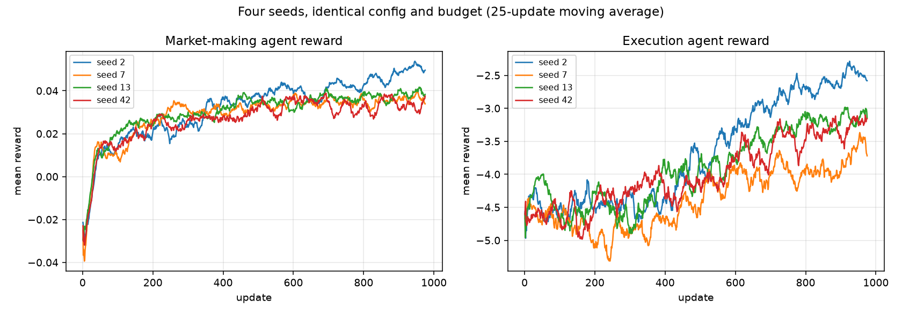
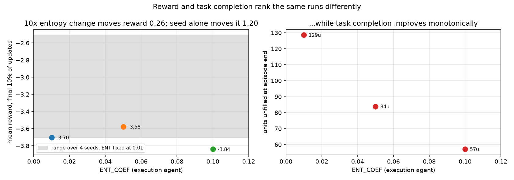
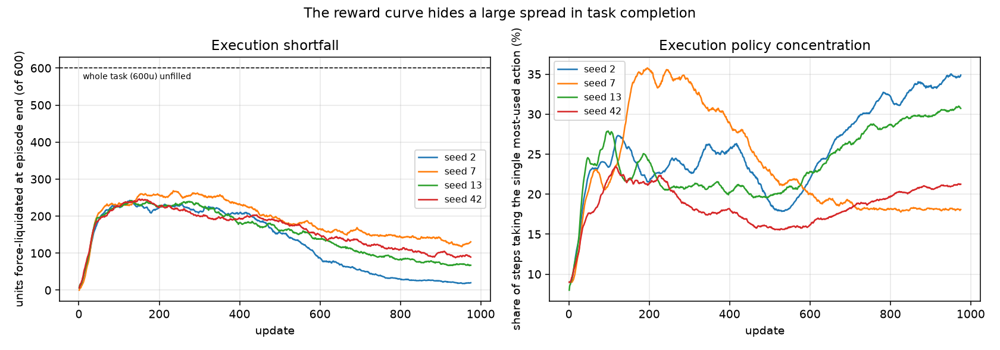
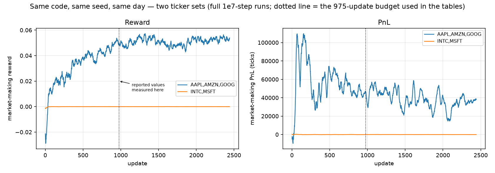

# A Reproducibility Study of Multi-Agent RL for High-Frequency Trading

Independent reproduction and robustness analysis of [JaxMARL-HFT](https://github.com/vmohl/JaxMARL-HFT),
a GPU-accelerated multi-agent RL framework in which a market-making agent and an
execution agent learn simultaneously inside a limit-order-book simulator driven by
real LOBSTER message data.

The framework reproduces. The *conclusions one would draw from a single training run
of it* largely do not. Across four seeds of an otherwise byte-identical configuration,
the execution agent's end-of-episode shortfall varies by **6×** (21 to 129 units of a
600-unit task), and a 10× change to the entropy coefficient moves the reward less than
one fifth as much as changing the seed alone. Separately, switching the traded ticker
from small-tick to large-tick names takes the market maker from roughly +45,000 to
roughly −44 in PnL with no change to code, seed, or hyperparameters.

This repository contains the runs, the extracted metrics, the analysis code, and the
figures behind those numbers.

---

## Contents

| Path | What it is |
|---|---|
| [`analysis/`](analysis/) | Log parsing, matched-budget tables, figures, spread analysis |
| [`results/metrics/`](results/metrics/) | Per-update metrics for every run, one tidy CSV each |
| [`results/raw_logs/`](results/raw_logs/) | The original training stdout, gzipped — the primary evidence ([one substitution](#a-note-on-the-raw-logs)) |
| [`results/figures/`](results/figures/) | The four figures below |
| [`results/summary_matched.csv`](results/summary_matched.csv) | Converged metrics, all runs truncated to a common budget |
| [`results/seed_variance.csv`](results/seed_variance.csv) | Spread statistics across seeds |
| [`results/spread_regime.csv`](results/spread_regime.csv) | Measured spread regime per ticker |
| [`results/mm_action_choice.csv`](results/mm_action_choice.csv) | Where the market maker ends up quoting, per regime |
| [`UPSTREAM_README.md`](UPSTREAM_README.md) | The original project's documentation (install, configs, agent types) |
| [`.env.example`](.env.example) | Template for the machine-specific paths (copy to `.env`) |

---

## Background

Henderson et al., *Deep Reinforcement Learning that Matters* (2018), showed that
reported differences between deep RL methods are routinely smaller than the variance
induced by the random seed, and that papers reporting a small number of runs can
therefore support conclusions the data does not. That critique is now standard for
benchmark control tasks.

Financial RL is a harder case for a reason that has nothing to do with the algorithm.
A MuJoCo environment is a fixed, stationary, infinitely resampleable simulator. A
limit-order-book environment is a replay of a particular set of trading days for a
particular set of tickers, and both of those choices change the task, not just the
noise. So the question this study asks is:

> **If you reproduce a multi-agent LOB-RL result and then vary only the things a paper
> usually does not report — the seed, the entropy coefficient, the ticker — how much of
> the result survives?**

## Experimental setup

Two agents trained jointly with IPPO (independent PPO, recurrent, separate networks and
separate hyperparameters per agent type):

- **Market maker (MM)** — posts a two-sided quote. Action space `fixed_quants`, reward
  `spooner_asym_damped2`, one share a side (`fixed_quant_value=1`), no inventory penalty. Each
  of its 10 actions offsets the quote outward from the touch by a multiple of half the spread;
  action 0 quotes at the touch. (`spread_multiplier` is set in the config but belongs to the
  `spread_skew` action space and is unused here.)
- **Execution agent (EXE)** — must execute a 600-unit parent order within the episode,
  direction drawn at random each episode. Action space `fixed_quants_complex` (13 actions),
  reward `normal`, `reward_lambda=0.1`. Whatever is unexecuted when the episode ends is
  force-liquidated at a penalised price ("doom" liquidation).

| | |
|---|---|
| Data | LOBSTER level-10, 2012-06-21, one full session (09:30–16:00) per ticker |
| Episode | 64 steps, 100 messages per step, episode starts every 64 s of session time |
| Rollout | 64 parallel envs × 64 steps |
| Budget | 4×10⁶ steps (975 updates) for the controlled comparisons; 10⁷ for two exploratory runs |
| Hardware | CPU-only (Apple silicon, single device) |

Seven runs in total: four seeds (2, 7, 13, 42) on `AAPL,AMZN,GOOG`; two entropy variants
on seed 7; one ticker variant (`INTC,MSFT`). `SEED` propagates to both the learner PRNG
and `world_config.seed`, so a seed change varies network init, action sampling, minibatch
order, *and* the episode-window draw — a full end-to-end seed change, not just a weight init.

**Every number reported below is measured over the first 975 updates of its run**, because
two runs were given 10⁷ steps and the rest 4×10⁶. Comparing final values across unequal
budgets would confound seed with training length; this is the single most important
methodological choice in the analysis and it changes the headline numbers substantially.
Figures are truncated to the same 975 updates, so what a figure shows is what the
accompanying table measures.

---

## Results

### 1. The framework reproduces

Both agents learn. The market maker goes from negative to positive reward within ~100
updates and holds it; the execution agent improves steadily, and its shortfall — which
peaks near 240 units early in training, as the policy first learns caution — falls back to
between 21 and 129 units depending on seed. Nothing here contradicts
the upstream work — the simulator, the training loop and the multi-agent setup all do what
they claim.

### 2. Seed variance swamps the effects a single run would report

Four seeds, identical configuration, identical budget. Metrics are means over the final
10% of updates:



| Metric | Mean | Std | Min | Max | Spread as % of mean |
|---|---:|---:|---:|---:|---:|
| MM reward | 0.0396 | 0.0073 | 0.0333 | 0.0499 | **42%** |
| EXE reward | −3.158 | 0.496 | −3.705 | −2.507 | **38%** |
| EXE units unfilled | 78.4 | 45.2 | 21.2 | 128.6 | **137%** |
| MM PnL | 57,149 | 8,816 | 45,358 | 66,721 | **37%** |
| MM inventory | −1.25 | 0.16 | −1.42 | −1.03 | 31% |

The execution shortfall — arguably *the* metric for an execution agent — ranges over a
factor of six across seeds. A paper reporting seed 2 would describe an agent that nearly
completes its task (96% filled); the same code on seed 7 completes 79%.

### 3. Reward and task completion rank the runs in opposite directions

The entropy coefficient was raised on the execution agent only (`ENT_COEF=[0.01, X]`,
the market maker held at 0.01), on a fixed seed:



| `ENT_COEF` (EXE) | EXE reward | Units unfilled | Fill rate |
|---|---:|---:|---:|
| 0.01 | −3.705 | 129 | 78.6% |
| 0.05 | −3.578 | 84 | 86.0% |
| 0.10 | −3.840 | **57** | **90.5%** |

Two things follow. First, **the 10× entropy sweep moves reward by 0.26, while the seed
alone moves it by 1.20** — the hyperparameter effect is 0.22× the noise it would have to
clear to be reported as real — and each entropy setting is itself n=1, run on seed 7 only,
so the 0.26 is a single draw from a distribution at least that wide. Second, and more interesting, the run with the *worst*
reward (0.10) has the *best* task completion. Reward and shortfall rank the runs in
opposite orders, so which hyperparameter you call "best" depends on which metric you
report, and the reward is the one the agent is optimising.

The execution agent also concentrates: by the end of training 18–34% of all steps take a
single discrete action out of 13, varying by seed (right panel below).



### 4. The ticker is a bigger lever than any hyperparameter tested

Same code, same seed, same calendar day, same budget — only the ticker set changes:



| Tickers | MM reward | MM PnL | MM inventory |
|---|---:|---:|---:|
| AAPL, AMZN, GOOG | +0.0499 | **+45,358** | −1.03 |
| INTC, MSFT | −0.00002 | **−44** | +0.01 |

The market maker is simply inert on INTC/MSFT: near-zero inventory, near-zero PnL, a flat
reward curve. Both runs in fact continued to 2,440 updates with the gap unchanged, so it
does not depend on where it is measured. Measuring the raw book explains why:

| Ticker | Median mid | Median spread | Share of time at a 1-tick spread |
|---|---:|---:|---:|
| AAPL | $583.25 | 15 ticks | 0.5% |
| AMZN | $222.66 | 13 ticks | 0.6% |
| GOOG | $569.88 | 28 ticks | 0.1% |
| MSFT | $30.77 | **1 tick** | **75.8%** |

| Ticker | Median depth at the touch |
|---|---:|
| AAPL | 100 shares |
| AMZN | 100 shares |
| GOOG | 100 shares |
| MSFT | **10,907 shares** |

The mechanism is queue position, and it is visible in the action the agent settles on. In
the `fixed_quants` action space each action offsets the quote *outward from the touch* by a
multiple of half the current spread — `bid_price = best_bid - bid_offset × half_spread` — so
action 0 quotes exactly at the touch and every other action quotes behind it. No action
quotes inside the spread. Quote size is `fixed_quant_value`, one share.

On the small-tick names the agent finds this: by the end of training it plays **action 0 in
100% of updates**, sitting at the touch behind a median of 100 resting shares, and it fills.
On the large-tick names that same placement puts one share behind a median of **10,907**
shares — a queue roughly 109× deeper — so it essentially never reaches the front and
essentially never fills. With no fills, no action produces a distinguishable reward, the
policy never converges at all, and it drifts among actions 1–3, which quote *behind* the
touch and are worse still. It ends at **0% at-touch**. Peak absolute inventory across the
entire 2,440-update run was **0.22 shares**.

The one-tick spread is what identifies the regime; the depth resting at that single price is
what does the damage.

Measured against this study's own yardstick, the ticker effect is **2.1× the seed spread**
in MM PnL (45,403 against 21,363), where the entropy sweep was 0.22× the seed spread in EXE
reward. The comparison is single-seed, which is the error this study criticises elsewhere,
but the gap is large enough and the mechanism concrete enough to carry it.

The execution agent is unaffected: on INTC/MSFT it reaches **96.4% fill**, within a tenth of
a point of the best run in the study (96.5%, seed 2 on the small-tick set). The large-tick
data is not the problem; the market maker's one-share quote against the resting queue is.

So the configuration is not a neutral default — it is implicitly specialised to small-tick,
high-priced names. A result demonstrated on AAPL/AMZN/GOOG says little about the same
agent on the large-tick names that make up most of the market. (INTC's level-1 book file
was not retained locally, so the regime table measures MSFT directly; INTC traded near $26
in 2012 and sits in the same tick-constrained regime.)

---

## What this adds up to

1. **Report seeds.** On this task, three to five seeds is a floor, not a nicety. Single-run
   numbers here carry spreads of 40–140%.
2. **Report task metrics, not only reward.** Shortfall and reward disagreed about which
   configuration was best. Reward alone would have selected the worse-executing agent.
3. **Treat the instrument as a hyperparameter.** Ticker choice dominated every algorithmic
   knob tested, through a concrete and checkable mechanism (queue position at the touch).
   LOB-RL results should state the tick regime they were obtained in, and report depth ahead
   of the agent's quote alongside fill rate.
4. **Henderson et al.'s critique transfers, and tightens.** The seed problem is the same;
   the data-selection problem is additional, and specific to environments replayed from
   recorded markets.

## Limitations

Stated plainly, because they bound every claim above.

- **One trading day** (2012-06-21) per ticker. Day-to-day variation is not measured and is
  plausibly as large as seed variation.
- **Four seeds** for the variance estimate. Enough to show the spread is large; not enough
  for a confidence interval, and the std values above should be read as indicative.
- **Reward magnitudes are not comparable across ticker sets.** EXE reward is −0.28 on
  INTC/MSFT against −2.5 to −3.7 on AAPL/AMZN/GOOG, which reflects price scale rather than
  performance. Fill rate is the comparable metric, and by it the two sets are level.
- **One run per condition** for the entropy and ticker comparisons (n=1), against four seeds
  for the variance estimate. Those two findings therefore rest on effect sizes and mechanism,
  not on repetition.
- **No baseline comparison.** `Calculate Baseline` was off, so the execution agent is not
  scored against TWAP or an immediate-execution benchmark. Shortfall is reported as a
  task-completion proxy, not as evidence of economic performance.
- **CPU-only, small networks** (GRU 64, FC 64, 64 envs) versus the upstream GPU defaults
  (256/256, 4096 envs). Conclusions about *variance* should hold; absolute performance is
  not comparable to a full-scale run.
- **Shortfall is derived, not logged directly.** `doom_quant` is logged as a mean over all
  rollout steps but is non-zero only on an episode's terminal step, so units-unfilled is
  recovered as `mean(doom_quant) × 64`. This assumes one episode boundary per 64-step
  rollout, which holds for `ep_type=fixed_steps` with `episode_time=64`. The derivation is
  in [`analysis/extract_metrics.py`](analysis/extract_metrics.py) and the raw means are in
  the per-run CSVs.
- **`market_share` logged NaN on every update**, since it divides by a traded volume that is
  zero on many steps. The MM's fill-rate evidence therefore comes from inventory and PnL
  rather than from direct volume capture.

## Reproducing

The analysis runs on the committed logs, with no LOBSTER data and no GPU:

```bash
pip install pandas matplotlib
python analysis/extract_metrics.py     # results/raw_logs/*.gz -> results/metrics/*.csv
python analysis/make_report.py         # -> summary_matched.csv, seed_variance.csv, figures/
```

`analysis/mm_action_choice.py` maps each action to where it places the quote and reports what
each regime converged on. `analysis/spread_regime.py` additionally needs the raw LOBSTER
books; its output is committed as `results/spread_regime.csv` so the finding is readable
without them.

### A note on the raw logs

The archived logs are the unmodified stdout of each training run, with one exception: the
absolute path of the machine they were produced on has been replaced by the literal string
`${JAXMARL_HFT_ROOT}`, the same placeholder the env configs now use. It appears 13–14 times
per log, all inside the configuration block the trainer echoes at startup
(`dataPath=`, `datapaths considered are [...]`, the checkpoint directory, and the
`saved_npz/` and `pre_reset_states/` cache paths).

The substitution is a pure prefix replacement and touches no line that the analysis reads —
`extract_metrics.py` parses only the `avg_reward_*` and `[MM]`/`[EXE]` lines. This was
verified by checksumming every file in `results/metrics/` plus the summary tables before and
after the edit: all ten are byte-identical. Run the two commands above against these logs and
you will reproduce the numbers in this README exactly.

To regenerate the training runs, follow the install and data setup in
[`UPSTREAM_README.md`](UPSTREAM_README.md). Point the code at your checkout and your
LOBSTER data by copying the template:

```bash
cp .env.example .env     # then edit JAXMARL_HFT_ROOT / JAXMARL_HFT_DATA
```

`.env` is gitignored, and both variables are optional — with no `.env` they default to
`.` and `./data`, which is correct when training is launched from the repo root. A real
environment variable overrides `.env`, so one-off runs work too
(`JAXMARL_HFT_DATA=/mnt/lobster ./train_seed.sh 7`). Then:

```bash
./train_seed.sh 7                 # one seed of the controlled comparison
./train_ent.sh 7 0.05             # entropy variant on the execution agent
./train_overnight.sh              # the 1e7-step exploratory run
```

Set the ticker set via `world_config.stock` in `config/env_configs/2_player_fq_fqc.json`
(comma-separated pools several tickers' windows into one training set).

## Changes made to the upstream code

Kept deliberately small, so that the reproduction tests upstream's code rather than a rewrite.

| File | Change |
|---|---|
| `gymnax_exchange/jaxrl/MARL/ippo_rnn_JAXMARL.py` | Per-update stdout summary of each agent's trading behaviour (shortfall, inventory, PnL, action concentration) — the upstream diagnostics only reach Weights & Biases, and these runs were offline. Checkpoint retention changed to pin ~25 snapshots across a run instead of 2. |
| `requirements.txt` | Made the CUDA wheel Linux-only so the CPU install resolves on macOS. |
| `gymnax_exchange/jaxen/exec_env.py` | Corrected four action-table comments that read `*3` for a `*5` quantity multiplier. |
| `gymnax_exchange/jaxob/jaxob_config.py` | Documented that `stock` accepts a comma-separated list (the loader already supported it) and must stay hashable for JIT. |
| `gymnax_exchange/jaxob/config_io.py` | Env configs may now reference `${VAR}` placeholders, resolved from the environment or a gitignored `.env`, so machine-specific absolute paths stay out of committed configs. |
| `.gitignore` | Fixed a missing newline that had fused two patterns into one invalid path; added caches and the negations that let `results/` be committed. |
| `config/`, `train_*.sh` | Experiment configuration for the runs above. |

No change was made to the environment dynamics, the reward functions, or the IPPO update.

## References

- Mohl, V., et al. *JaxMARL-HFT: GPU-Accelerated Multi-Agent Reinforcement Learning for High-Frequency Trading.* [arXiv:2511.02136](https://arxiv.org/abs/2511.02136) · [ACM ICAIF '25](https://dl.acm.org/doi/full/10.1145/3768292.3770416) · [code](https://github.com/vmohl/JaxMARL-HFT)
- Henderson, P., Islam, R., Bachman, P., Pineau, J., Precup, D., Meger, D. *Deep Reinforcement Learning that Matters.* [arXiv:1709.06560](https://arxiv.org/abs/1709.06560)
- Frey, S., et al. *JAX-LOB: A GPU-Accelerated Limit Order Book Simulator.* [code](https://github.com/KangOxford/jax-lob)
- Rutherford, A., et al. *JaxMARL: Multi-Agent RL Environments in JAX.* [code](https://github.com/FLAIROx/JaxMARL)

## License and data

This repository is derived from [vmohl/JaxMARL-HFT](https://github.com/vmohl/JaxMARL-HFT)
and redistributed under the same Apache License 2.0 — see [`LICENSE`](LICENSE). Files modified
relative to upstream are listed in *Changes made to the upstream code* above; everything not
listed there is unmodified upstream work by the original authors.

LOBSTER market data is licensed and is **not** redistributed here; `data/` is gitignored.
Obtain it from [LOBSTER](https://lobsterdata.com/) under your own license to rerun training.
The committed logs, metrics and figures are derived statistics of training runs, not market data.
